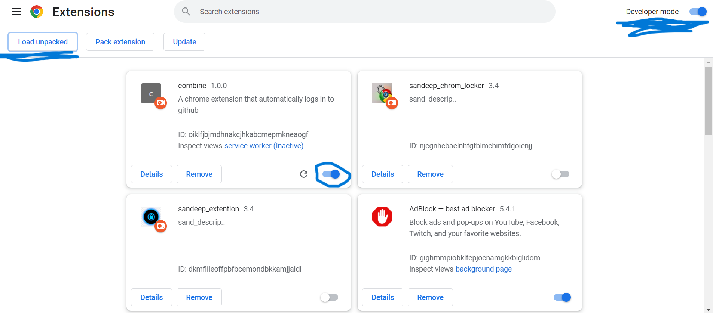
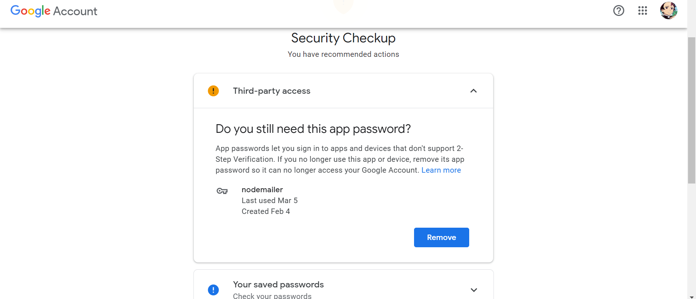
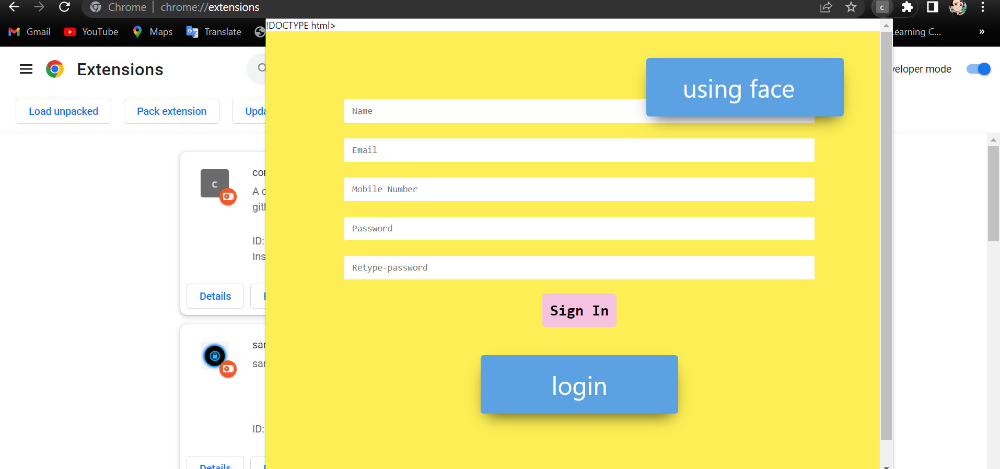
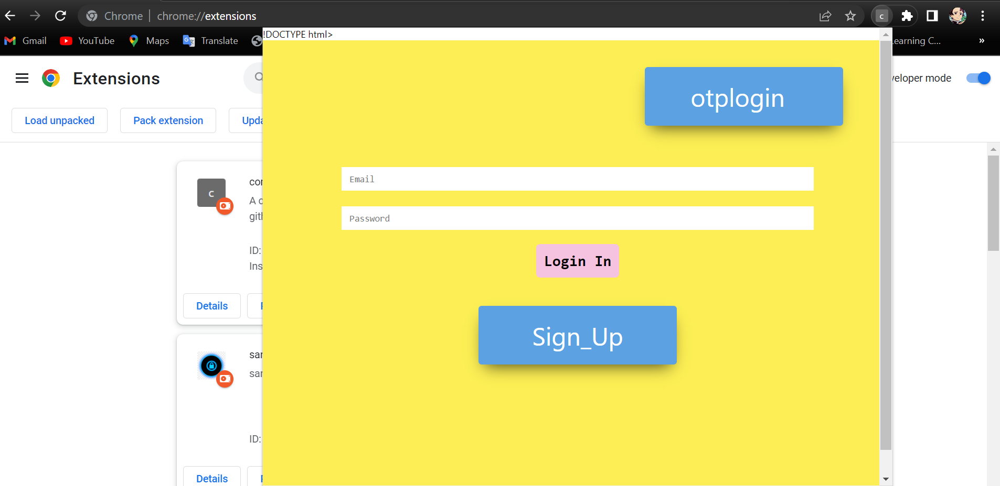
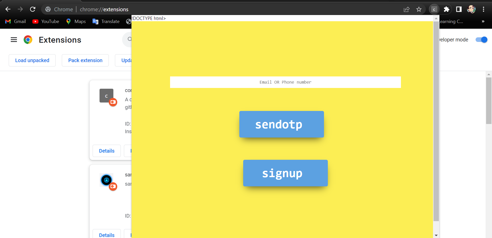

# what does this extension do

By using this we can skip login page after login for site then this extension takes your credentials and save it in database, while saving your credentials we use end-to-end encryption

# how to set-up

Download final folder, inside final folder there are two folders one is extension(frontend) and another is backend, we need setup as follow

## how to setup extension(frontend) ???

go to browser extension setting , click developer mood on then click load unpack and go inside your extension(frontend) folder (make sure you are inside extension (frontend) folder where all different file like server.js , img.txt and other present ) click select folder and your extension is ready to go make sure you extension is turn on



## how to setup backend(server)???

Go to terminal and open backend directory, you need to install npm package separately all the packages listed in package.json
Since all required packages are present in package.json file so you don't need to install all package separately you just need to run command

```bash
npm i

```

You have to run npm i (not npm init -y and not other commands otherwise you have to install all packages separately)

# set for sending otp by mail or phone

## sending otp at mail by using nodemailer

You must allow nodemailer to mail from Google settings

for that you have to do following steps-

1 Log in to your Google account
Go to security

2 Under Signing in to Google enable 2-Step Verification

3 Under Signing in to Google click on App passwords.

4 You'll now generate a new password. Select the app as Mail and the device as Other (Custom name) and name it.

5 Save the app password

## path

1 https://www.google.com/settings/security/lesssecureapps

2 https://g.co/allowaccess



#### if you are facing any issu then follow this link

stackoverflow(https://stackoverflow.com/questions/19877246/nodemailer-with-gmail-and-nodejs)

# how to start server

for starting servere you have to run command

```bash
node servere.js
```

and you are good to go

# how to use ???

first turn on your extension as says upper ,now click on
Extension icons then click your extension icons then popup window will open then you have to signin first



then you have to login as follow



you can also login by sending otp at registered email or phone number



# how hole thinks works???

comming soon .....
